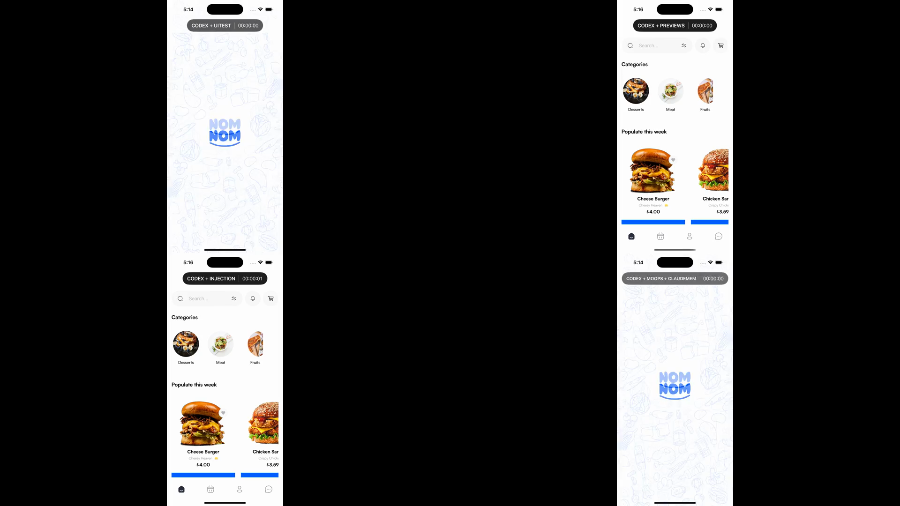
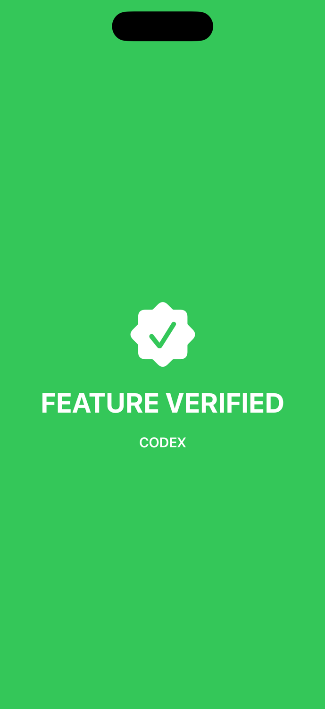

# MOOPS

[](https://github.com/viktorinkov/Moops/raw/refs/heads/main/results/live-demo/moops-four-arm-live.mp4)

## [▶ Watch the four-arm live benchmark](https://github.com/viktorinkov/Moops/raw/refs/heads/main/results/live-demo/moops-four-arm-live.mp4)

Four synchronized Codex agents build and verify the same real iOS feature in one continuous run.

**Four live setups:** `CODEX + UITEST` · `CODEX + PREVIEWS` ·
`CODEX + INJECTION` · `CODEX + MOOPS + CLAUDEMEM`

| Recording position | Left | Right |
| --- | --- | --- |
| Top | `CODEX + UITEST` | **`CODEX + PREVIEWS`** |
| Bottom | `CODEX + INJECTION` | `CODEX + MOOPS + CLAUDEMEM` |

The canonical artifact is a continuous **1:01:38.300, 1920×1080 H.264 MP4**
aligned to the shared release, with a shared-epoch elapsed-time HUD on every arm.

I currently work as a research software engineer at the Snyder Lab at Stanford,
where I develop the native Android and iOS apps for StudySync, a wearable health
data collection platform.

I previously worked as a web developer. In my work, coding agents handle web
tasks more reliably than native iOS tasks.

Public benchmarks show the same direction:

- Vercel's [Next.js agent evaluation](https://nextjs.org/evals) reports a 92%
  task success rate for Codex + GPT-5.6 Sol (ultra) on isolated Next.js
  code-generation and migration tasks.
- [SWE-Bench Mobile](https://swebenchmobile.com/leaderboard) evaluates 50 tasks
  from a production iOS codebase. Codex + GPT-5 completes 10% (5/50). The best
  tested configuration completes 12% (6/50).

This is directional evidence, not a controlled web-versus-iOS comparison. The
benchmarks use different models, task scopes, codebases, and harnesses.
SWE-Bench Mobile covers one production iOS codebase. See the
[SWE-Bench Mobile paper](https://arxiv.org/abs/2602.09540).

OpenAI described the original Codex-1 model as trained with reinforcement
learning on real-world coding tasks. Codex can iterate, run tests, and inspect
evidence until the implementation passes. See
[Introducing Codex](https://openai.com/index/introducing-codex/).

The reinforcement loop differs between web and mobile.

On the web:

```text
edit → hot module replacement → agent can inspect and verify the result
```

On mobile:

```text
edit → build → restore state from scratch → agent can inspect and verify the result
```

MOOPS restores the last verified real-app checkpoint after a rebuild. It keeps
the agent inside the real iOS verification loop:

```text
edit → build → restore checkpoint → agent can inspect and verify the result
```

## MOOPS flow

1. Verify three progressively deeper app checkpoints.
2. Store each name, path, and fingerprint in Claude-Mem.
3. Start fresh Codex and recall all three checkpoints.
4. Select `checkout-ready`, the deepest useful state.
5. Let MOOPS validate the descriptor and preconditions.
6. Edit, build, and install without uninstalling the app.
7. Launch, replay the shortest public route, and capture fresh accessibility.
8. Let the agent inspect the UI result and backend receipt before continuing.

## How it works


- A checkpoint declares the app, simulator, fixture version, adapter commands,
  public UI trace, and landing predicates.
- Its SHA-256 fingerprint covers the canonical checkpoint payload.
- MOOPS validates the checkpoint before running direct argument arrays.
- MOOPS runs build, install, launch, replay, and evidence capture in fixed order.
- The FoodDelivery adapter uses `simctl install` to replace the binary without
  uninstalling durable app data.
- XCUITest reacquires elements after launch and returns a fresh accessibility
  tree.
- MOOPS evaluates every landing predicate and reports the first failed phase.
- The agent inspects the MOOPS report and backend receipt before continuing.
- The external Codex Goal owns the repeat loop. MOOPS does not invoke an LLM.

The checkpoint is a descriptor and replay recipe. It never contains process
memory, SwiftUI objects, navigation objects, `XCUIElement` handles, a fake login,
or a fake order response.

The real app owns the session, Core Data cart, saved preference, and navigation.
The local backend owns the catalog, prices, and order receipt. Missing durable
state makes the restore fail. MOOPS does not invent it.

### Claude-Mem is required

- The agent records `catalog-ready`, `cart-ready`, and `checkout-ready` as three
  memory packets.
- A fresh Codex process calls Claude-Mem in the required order:
  `search → timeline → get_observations`.
- Claude-Mem must return the exact checkpoint names, paths, and fingerprints.
- Fresh Codex selects `checkout-ready`, the deepest useful checkpoint.
- The runner requires verified recall before MOOPS starts.
- MOOPS revalidates the selected checkpoint file before it executes any command.
- Missing or incorrect recall stops the workflow.
- Claude-Mem supplies continuity. Fresh UI and backend evidence remain the
  source of truth.

The measured workflow cannot bypass recall with a known local path. Claude-Mem
indexing and recall stay inside the same external Goal clock.

## Why has nobody done it yet?

- XCUITest can drive the real app.
- InjectionIII can avoid some rebuilds.
- Previews can mock local UI state.
- None defines a fail-closed resume contract after a structural rebuild.

MOOPS stores a descriptor and replay recipe, not a simulator snapshot.
Claude-Mem helps fresh Codex find it. MOOPS rejects it if the fingerprint,
preconditions, replay, or landing state changed.

## Why is it technically challenging?

- MOOPS must replace the binary without deleting simulator data.
  - Solved by: the FoodDelivery install adapter runs `simctl install` for the
    same bundle ID and stops on a non-zero result.
- A restore cannot reuse process-local navigation after launch.
  - Solved by: MOOPS launches a new process, then runs the checkpoint's public
    `wait` and `tap` trace.
- Relaunch invalidates previous `XCUIElement` handles.
  - Solved by: XCUITest queries fresh elements for every step and returns a new
    accessibility observation.
- Trace completion does not prove the correct screen was reached.
  - Solved by: MOOPS checks fresh nodes against `exists` and `equals` predicates
    and fails the `landing` phase on any mismatch.
- A checkpoint controls host commands and public UI actions.
  - Solved by: MOOPS validates exact keys and bounds, executes argv with
    `shell: false`, and recomputes canonical SHA-256 before execution.
- Claude-Mem recalls descriptor identity, not simulator state.
  - Solved by: fresh Codex retrieves the exact path and fingerprint; MOOPS
    rereads the file and recomputes its fingerprint before build.
- No later phase may run after an earlier phase fails.
  - Solved by: MOOPS awaits a fixed phase order, stops on the first error, and
    returns one versioned JSON report naming the failed phase.
- The UI adapter is an external process with untrusted output.
  - Solved by: MOOPS requires one JSON object, rejects non-zero exits or
    `ok != true`, and caps command output at 1 MiB.

## Existing solutions

### [InjectionIII](https://github.com/johnno1962/InjectionIII)

```text
edit → inject code into the running app → agent can inspect and verify the result
```

InjectionIII keeps the app process and its state alive for compatible edits.

It works well for:

- changing a function or method body;
- visual styling; and
- local layout or text changes.

It cannot preserve the process for this benchmark's structural changes:

- add or remove a stored property;
- add, rename, or delete a source file; or
- change a domain model's memory layout.

### Xcode Previews

```text
edit → construct preview state → render → agent can inspect and verify the preview
```

Previews provide local UI feedback. They can rebuild a view after a
stored-property change.

For this checkout screen, a faithful Preview must separately construct:

- the authenticated session;
- two persisted cart items;
- backend catalog and prices;
- saved checkout state; and
- the correct navigation context.

That Preview is useful feedback. It is still not the actual navigated app, its
installed persistent store, or the real order POST. The real-app acceptance
test is still required.

### Xcode UI automation

```text
edit → build → launch → recreate preconditions → navigate → agent can inspect and verify the result
```

UI automation is the source of truth. It sees the real app and can prove the
full journey. Its cost is repeatedly recreating the journey after each rebuild.

MOOPS uses the same public automation surface. It resumes from a validated
checkpoint instead of treating every iteration as a cold start.

## How we are benchmarking MOOPS

The task is deliberately small and structural: add a persisted delivery
preference to FoodDelivery checkout.

The feature must:

- add a new `DeliveryPreference` Swift source type;
- add stored view-model state;
- extend the `Order` domain model;
- survive terminate and relaunch;
- send `delivery_preference: "Meet at door"` to the local backend; and
- finish on a green, real-app `FEATURE VERIFIED` screen tied to that exact run.

The restaurant, menu, and prices come from a deterministic local HTTP backend.
The session, cart, preference, and navigation remain inside the real app.

### Benchmark controls

Every run uses the same:

- fixed feature prompt;
- simulator seed;
- deterministic backend; and
- final XCUITest and backend receipt gate.

### What we measure

The benchmark measures:

- Claude-Mem index and recall time;
- checkpoint validation time;
- build, install, launch, replay, and inspect time;
- time to fresh real-app feedback;
- failed phase and stable error code; and
- final XCUITest and backend receipt result.

### Recovery-contract diagnostic matrix

The benchmark treatments expose different recovery surfaces. This matrix is a
design diagnostic, separate from the timed results below:

| Required capability | UI automation | Xcode Preview | InjectionIII | MOOPS + Claude-Mem |
| --- | --- | --- | --- | --- |
| Real installed app is the source of truth | Yes | No | Yes | **Yes** |
| Handles a new file/stored-property/domain-model rebuild | Yes | Yes | Falls back to build | **Yes** |
| Preserves app-owned session and durable cart | Recreate journey | Reconstruct separately | Only while process survives | **Yes** |
| Uses the real deterministic backend and order receipt | Yes | No | Yes while connected | **Yes** |
| Named, tamper-evident resume artifact | No | No | No | **Yes** |
| Recallable by a fresh agent process | No | No | No | **Yes** |
| Reconstructs navigation through public controls | Full journey | Synthetic setup | Existing process | **Shortest verified route** |
| Freshly revalidates the landing after relaunch | Yes | Preview only | Not after structural fallback | **Yes** |
| Fails closed when context is stale or incomplete | Test-specific | Preview-specific | Treatment-specific | **Yes, across the full contract** |

UI automation remains the final source of truth, but it has no reusable context
artifact in the baseline. Previews can render structural changes, but require a
separate reconstruction of session, cart, catalog, and navigation. InjectionIII
is excellent for compatible in-process edits, but this benchmark deliberately
adds a source file and changes stored/domain state. MOOPS combines the real-app
truth of UI automation with a durable, externally recallable resume contract.

The four-arm protocol gives each arm its own worktree, simulator, DerivedData,
backend port, results directory, and isolated Codex home. All four use Apple's
official Xcode MCP through `/usr/bin/xcrun mcpbridge`, bound to a distinct Xcode
process and exact project tab. All four receive the same feature prompt, model,
service tier request, baseline commit, deterministic fixture, three-hour
deadline, durable Goal objective, and final XCUITest/backend receipt gate. Only
the intended treatment differs.

## Results: MOOPS reaches the shared real-app gate first

### [▶ Video proof: watch the canonical four-arm live benchmark](https://github.com/viktorinkov/Moops/raw/refs/heads/main/results/live-demo/moops-four-arm-live.mp4)

The canonical recording shows the synchronized release, four isolated Codex
agents, four labeled real simulator apps, shared-epoch timers, and the visible
verification milestones in one continuous run.

**Read the 2×2 recording:** UITEST is top-left, **PREVIEWS is top-right**,
INJECTION is bottom-left, and MOOPS + CLAUDEMEM is bottom-right. Each tile has
its treatment label and shared-epoch elapsed timer.

<a href="https://github.com/viktorinkov/Moops/raw/refs/heads/main/results/live-demo/moops-four-arm-live.mp4">
  
</a>

### Live take 7

Arm D, `CODEX + MOOPS + CLAUDEMEM`, recorded the first exit-0 execution of the
shared real-app acceptance test **23 minutes 25.252 seconds** after synchronized
release.

| Arm | Treatment | Exit-0 shared acceptance time |
| --- | --- | ---: |
| D | `CODEX + MOOPS + CLAUDEMEM` | **23:25.252** |
| C | `CODEX + INJECTION` | 29:30.248 |
| A | `CODEX + UITEST` | 30:30.096 |
| B | `CODEX + PREVIEWS` | 58:31.964 |

The exact timestamps, event sequence numbers, comparison arithmetic, video
properties, and SHA-256 are preserved in the
[machine-readable timing receipt](results/runs/final-20260823-7/benchmark-timings.json).
The complete [redacted four-arm transcript bundle](results/runs/final-20260823-7/)
preserves every agent request, response, command receipt, MCP event, and arm
result for independent inspection.

Arm D reached the common gate **6 minutes 4.996 seconds** ahead of the
next-fastest result. That is **20.62% less elapsed time**, or the same verified
outcome about **1.26× sooner**. Each measurement begins at the shared
`startEpochMs` release and ends when the actual `xcodebuild` command for
`test3DeliveryPreferenceAcceptance` completes with exit 0.

Against the UI-automation arm, MOOPS reached the same gate **7 minutes 4.844
seconds sooner**. Against the Preview arm, MOOPS reached it **35 minutes 6.712
seconds sooner**, approximately **2.50× sooner**.

`CODEX + PREVIEWS` also completed the full ordered four-test suite and rendered
the feature Preview through Apple’s official Xcode MCP.

#### Arm B Preview evidence

<a href="results/runs/final-20260823-7/preview-render-feature-verified.png">
  
</a>

The [RenderPreview receipt](results/runs/final-20260823-7/preview-render-feature-verified.json)
binds this image to Arm B, Xcode MCP event 4744, the Preview arm’s exact project
tab, and the image SHA-256.

### What the shared acceptance proved

The 66.295-second Arm D XCUITest exercised the complete real-app acceptance
path:

1. Launch the installed app with its persisted authenticated session.
2. Load the catalog and prices from the arm's isolated HTTP backend.
3. Reacquire the persisted Core Data cart through the public Home-to-Cart path.
4. Change `checkout.deliveryPreference` to `Meet at door`.
5. Terminate and relaunch the app, then confirm the saved selection.
6. Place the real order and inspect the backend receipt.
7. Reach the green `FEATURE VERIFIED` screen with the Arm D label.
8. Demonstrate run-scoped verification with a second run ID, then relaunch and
   restore the result associated with the current run identity.

The independent backend receipt records the exact request:
`delivery_preference: "Meet at door"`, `order_status: "process"`,
`status: "published"`, and two units of food `id: 1`. The normalized order is
order `101`: two Cheese Burgers at **$4.00 each** from **Wendy’s**, with the same
delivery preference. The app's visible result, XCUITest assertions, and backend
receipt all describe the same accepted journey.

The implementation is normal application code:

- [`DeliveryPreference`](benchmark/FoodDelivery/Food%20Delivery/Domain/Entity/DeliveryPreference.swift)
  defines the two user-visible choices;
- the real checkout screen publishes the accessible control;
- `UserDefaults` retains the selection across process launches;
- Core Data retains the cart across replacement builds;
- `Order` decodes and submits `delivery_preference`; and
- the run-scoped verification receipt restores the green result for the current
  benchmark identity.

The source passes a normal Xcode application build and `build-for-testing` for
the shared `FoodDeliveryBenchmark` scheme. The
[acceptance flow](benchmark/FoodDelivery/FoodDeliveryBenchmarkUITests/BenchmarkFlowUITests.swift)
ships with the fixture and checks the same state, request, receipt, and visible
result.

### What MOOPS and Claude-Mem add

MOOPS exposes three executable, fingerprinted levels of real app context:

| Checkpoint | Context owned by the real systems | Fresh landing proof |
| --- | --- | --- |
| [`catalog-ready`](benchmark/checkpoints/food-delivery-catalog-ready.json) | Authenticated app plus backend catalog and prices | Home and catalog accessibility nodes exist |
| [`cart-ready`](benchmark/checkpoints/food-delivery-cart-ready.json) | The same session and catalog plus the persisted Core Data cart | Home reports the exact two-item cart |
| [`checkout-ready`](benchmark/checkpoints/food-delivery-cart.json) | The same installed data at the shortest public route into checkout | Cart and checkout nodes exist and Place Order is enabled |

Every checkpoint declares the fixture, app, simulator binding, literal adapter
argv, public replay trace, fresh landing predicates, and canonical SHA-256
fingerprint. `tools/moops/moops build-and-restore` validates the descriptor,
builds the app, performs a replacement install that preserves its container,
launches the bundle, replays the public route, obtains a new accessibility tree,
and evaluates every landing predicate.

Two sanitized receipts measure those restores directly:

- [`catalog-ready`](results/moops/catalog-ready-restore.json) completes build,
  replacement install, launch, replay, fresh inspection, and landing validation
  in **35.56 seconds**.
- [`checkout-ready`](results/moops/checkout-ready-restore.json) completes the
  deepest cart-to-checkout restore in **17.37 seconds**.

The [Claude-Mem](https://github.com/thedotmack/claude-mem) integration uses a
[checkpoint registry](benchmark/claude-mem/checkpoints.json) that stores the
three checkpoint names, paths, and exact fingerprints. Fresh Codex retrieves
them through `search → timeline → get_observations`, selects `checkout-ready`,
and hands the descriptor back to MOOPS for live validation and restoration.

```text
Claude-Mem recalls the verified context
→ MOOPS rebuilds and restores it
→ fresh UI plus the backend receipt verify the current app
```

The state boundary stays explicit: the app owns its authenticated session,
`UserDefaults` preference, and Core Data cart; the backend owns the catalog,
prices, and order receipt; XCUITest reconstructs ephemeral navigation through
public controls; and accessibility provides a fresh observation after launch.
In the synchronized live take, this combined treatment reached the shared gate
first.

### Engineering evidence

The repository has **126 passing contract tests**, plus a real Claude-Mem
runtime lifecycle smoke test:

- 25 MOOPS tests for descriptor validation, fingerprinting, literal argv,
  ordered restore phases, fresh UI inspection, and evidence-gated execution;
- 10 backend tests for deterministic catalog and authentication data, validated
  orders, receipts, assets, and reset behavior;
- 25 Claude-Mem tests for fresh recall, fingerprint identity, store isolation,
  ordered MCP use, and worker lifecycle;
- 13 InjectionIII tests for the pinned 5.2.1 runtime, watcher and connection
  evidence, injection event capture, and structural rebuild handling; and
- 53 runner tests for common controls, isolated homes, worktrees, simulators,
  DerivedData, backends, results, durable Goals, acceptance, recording,
  transcripts, cleanup, and evidence propagation.

The four-arm runner isolates each treatment's app data, build products, backend,
agent home, transcript, and result artifacts. Apple's official Xcode MCP runs
through `/usr/bin/xcrun mcpbridge`, Claude-Mem provides the fresh-agent memory
path, and the shared XCUITest plus backend receipt define one common finish
line.

### What this unlocks

- **For iOS developers:** MOOPS turns a deep real-app state into a reusable
  developer checkpoint. Teams can add checkpoints and direct-argv adapters for
  their own apps through the open checkpoint schema and UI adapter protocol.
- **For agent training:** verified checkpoints create reusable starting states
  for more edit, build, restore, inspect, and reward cycles within the same
  compute budget.
- **For agent evaluation:** fingerprints, isolated backends, fresh accessibility,
  and backend receipts make native iOS tasks reproducible and evidence-based.
- **For engineering organizations:** agents and CI can return to authenticated,
  data-rich product flows quickly, shortening feedback on checkout, onboarding,
  account, and other stateful journeys.
- **For the open-source ecosystem:** Claude-Mem supplies portable continuity,
  MOOPS supplies deterministic restoration, and any compatible iOS project can
  define its own state ownership, replay route, and landing evidence.

## Impact

Real stateful iOS work is dominated by more than compilation. An agent must
recover an authenticated session, deterministic backend data, persistent app
state, and the right navigation depth before it can observe whether an edit
worked. Repeating that setup consumes simulator time, agent tokens, and the
limited wall-clock budget of every training rollout or evaluation task.

MOOPS turns that repeated setup into a verified starting state:

```text
edit → build → restore → agent inspects and verifies → reward
```

The reward still comes from the real product journey: fresh accessibility,
persisted app state, an actual backend request, and a visible accepted result.
The checkpoint only shortens the path back to the place where useful work can
continue. That distinction makes the restored trajectory suitable for both
developer agents and evidence-based evaluation.

### Faster reinforcement-learning and evaluation loops

MOOPS does not embed or train an LLM. It supplies infrastructure that can make
future Codex reinforcement-learning loops faster by increasing the number of
real, verified mobile trajectories collectable under a fixed compute budget.
When environment reconstruction becomes cheaper, the same simulator fleet and
agent budget can spend more of each rollout on editing, observing, correcting,
and reaching a reward.

That creates four compounding advantages:

- **Higher rollout throughput:** more edit/build/verify attempts per
  simulator-hour.
- **Denser useful rewards:** more trajectories reach deep authenticated states
  where meaningful cross-screen and backend behavior can be judged.
- **Harder mobile curricula:** training can begin from catalog, populated-cart,
  or checkout checkpoints instead of repeatedly spending the trajectory on
  login and setup.
- **Reproducible comparisons:** the checkpoint fingerprint, backend fixture,
  replay trace, accessibility evidence, and receipt make the starting and
  finishing conditions inspectable.

The live result demonstrates the practical direction: the MOOPS arm reached the
shared real-app acceptance command at **23:25.252**, **6:04.996 ahead** of the
next-fastest treatment, using **20.62% less elapsed time**. The separate restore
receipts also show a complete `catalog-ready` replacement-build recovery in
**35.56 seconds** and the deeper `checkout-ready` recovery in **17.37 seconds**.

### Business value

For an AI coding platform, the core economic unit is not generated code; it is
an accepted trajectory backed by trustworthy evidence. MOOPS can improve that
unit by reducing setup work before every mobile verification attempt. At scale,
that can mean:

- lower simulator-fleet cost per accepted iOS task;
- faster benchmark feedback when a model, prompt, or tool policy changes;
- more difficult stateful examples within the same training run;
- shorter agent turnaround for checkout, onboarding, account, and other deep
  product flows; and
- reusable regression-reproduction states for testing and model
  improvement.

For an iOS engineering organization, the same mechanism becomes developer
infrastructure. A team can version a small set of high-value checkpoints,
connect them to deterministic local services, and give both humans and agents a
repeatable route back to expensive application states. Claude-Mem adds portable
recall across fresh agent sessions; MOOPS validates and executes the real-app
restore; XCUITest, accessibility, and backend receipts provide the reward
evidence.

### An open measurement surface

Because the runner stores synchronized clocks, exact commands, transcripts,
checkpoint fingerprints, restore phase timings, and backend receipts, future
experiments can measure the quantities that matter:

- accepted trajectories per simulator-hour;
- median time from rebuild to fresh deep-state observation;
- agent tokens and compute cost per accepted feature;
- reward density at progressively deeper checkpoints; and
- transfer of the same MOOPS adapter contract across real iOS repositories.

This makes MOOPS useful beyond one demo. It is a small open-source foundation
for testing how durable real-app context changes native-agent capability,
training throughput, and the economics of verified mobile software work.

## Attribution

MOOPS is inspired by
[Jerboa](https://github.com/yasenhorozov/jerboa/commits/main/), which is focused
on Android.

MOOPS is MIT licensed. The FoodDelivery fixture is a modified benchmark copy of
[spencer2k19/FoodDelivery](https://github.com/spencer2k19/FoodDelivery) at
commit `f4c8974029bfd019c126b3db1c2cddf3b6f78ae5`. See
[`THIRD_PARTY_NOTICES.md`](THIRD_PARTY_NOTICES.md) for attribution.
