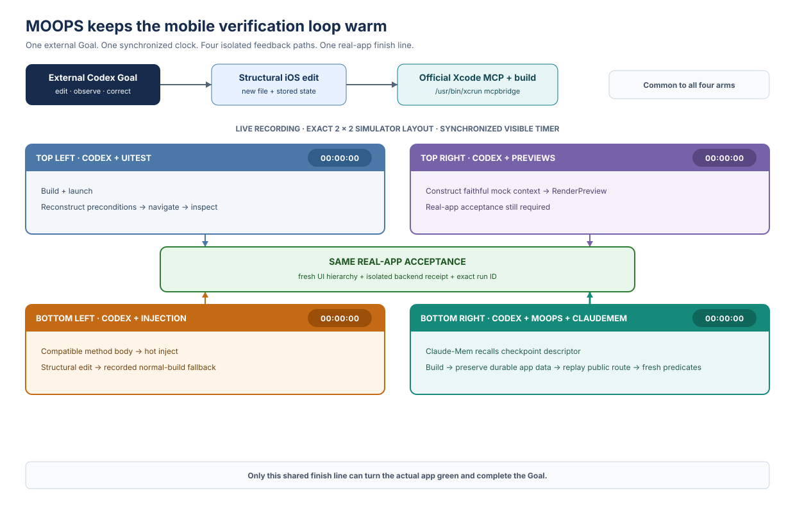

# MOOPS

I currently work as a research software engineer at the Snyder Lab at Stanford,
where I develop the native Android and iOS apps for StudySync, a wearable health
data collection platform.

I previously worked as a web developer. In my work, coding agents handle web
tasks more reliably than native iOS tasks.

Public benchmarks show the same direction:

- Vercel's [Next.js agent evaluation](https://nextjs.org/evals) reports a 92%
  task success rate for Codex + GPT-5.6 Sol (ultra) on isolated Next.js
  code-generation and migration tasks.
- [SWE-Bench Mobile](https://swebenchmobile.com/leaderboard) evaluates 50 tasks
  from a production iOS codebase. Codex + GPT-5 completes 10% (5/50). The best
  tested configuration completes 12% (6/50).

This is directional evidence, not a controlled web-versus-iOS comparison. The
benchmarks use different models, task scopes, codebases, and harnesses.
SWE-Bench Mobile covers one production iOS codebase. See the
[SWE-Bench Mobile paper](https://arxiv.org/abs/2602.09540).

OpenAI described the original Codex-1 model as trained with reinforcement
learning on real-world coding tasks. Codex can iterate, run tests, and inspect
evidence until the implementation passes. See
[Introducing Codex](https://openai.com/index/introducing-codex/).

The reinforcement loop differs between web and mobile.

On the web:

```text
edit → hot module replacement → agent can inspect and verify the result
```

On mobile:

```text
edit → build → restore state from scratch → agent can inspect and verify the result
```

MOOPS restores the last verified real-app checkpoint after a rebuild. It keeps
the agent inside the real iOS verification loop:

```text
edit → build → restore checkpoint → agent can inspect and verify the result
```

## MOOPS flow

1. Verify three progressively deeper app checkpoints.
2. Store each name, path, and fingerprint in Claude-Mem.
3. Start fresh Codex and recall all three checkpoints.
4. Select `checkout-ready`, the deepest useful state.
5. Let MOOPS validate the descriptor and preconditions.
6. Edit, build, and install without uninstalling the app.
7. Launch, replay the shortest public route, and capture fresh accessibility.
8. Let the agent inspect the UI result and backend receipt before continuing.

## How it works



- A checkpoint declares the app, simulator, fixture version, adapter commands,
  public UI trace, and landing predicates.
- Its SHA-256 fingerprint covers the canonical checkpoint payload.
- MOOPS validates the checkpoint before running direct argument arrays.
- MOOPS runs build, install, launch, replay, and evidence capture in fixed order.
- `simctl install` replaces the app binary without uninstalling durable app data.
- XCUITest reacquires elements after launch and returns a fresh accessibility
  tree.
- MOOPS evaluates every landing predicate and reports the first failed phase.
- The agent inspects the MOOPS report and backend receipt before continuing.
- The external Codex Goal owns the repeat loop. MOOPS does not invoke an LLM.

The checkpoint is a descriptor and replay recipe. It never contains process
memory, SwiftUI objects, navigation objects, `XCUIElement` handles, a fake login,
or a fake order response.

The real app owns the session, Core Data cart, saved preference, and navigation.
The local backend owns the catalog, prices, and order receipt. Missing durable
state makes the restore fail. MOOPS does not invent it.

### Claude-Mem is required

- The agent records `catalog-ready`, `cart-ready`, and `checkout-ready` as three
  memory packets.
- A fresh Codex process calls Claude-Mem in the required order:
  `search → timeline → get_observations`.
- Claude-Mem must return the exact checkpoint names, paths, and fingerprints.
- Fresh Codex selects `checkout-ready`, the deepest useful checkpoint.
- The runner requires verified recall before MOOPS starts.
- MOOPS revalidates the selected checkpoint file before it executes any command.
- Missing or incorrect recall stops the workflow.
- Claude-Mem supplies continuity. Fresh UI and backend evidence remain the
  source of truth.

The measured workflow cannot bypass recall with a known local path. Claude-Mem
indexing and recall stay inside the same external Goal clock.

## Why has nobody done it yet?

- XCUITest can drive the real app.
- InjectionIII can avoid some rebuilds.
- Previews can mock local UI state.
- None defines a fail-closed resume contract after a structural rebuild.

MOOPS stores a descriptor and replay recipe, not a simulator snapshot.
Claude-Mem helps fresh Codex find it. MOOPS rejects it if the fingerprint,
preconditions, replay, or landing state changed.

## Why is it technically challenging?

- MOOPS must replace the binary without deleting simulator data.
  - Solved by: the FoodDelivery install adapter runs `simctl install` for the
    same bundle ID and stops on a non-zero result.
- A restore cannot reuse process-local navigation after launch.
  - Solved by: MOOPS launches a new process, then runs the checkpoint's public
    `wait` and `tap` trace.
- Relaunch invalidates previous `XCUIElement` handles.
  - Solved by: XCUITest queries fresh elements for every step and returns a new
    accessibility observation.
- Trace completion does not prove the correct screen was reached.
  - Solved by: MOOPS checks fresh nodes against `exists` and `equals` predicates
    and fails the `landing` phase on any mismatch.
- A checkpoint controls host commands and public UI actions.
  - Solved by: MOOPS validates exact keys and bounds, executes argv with
    `shell: false`, and recomputes canonical SHA-256 before execution.
- Claude-Mem recalls descriptor identity, not simulator state.
  - Solved by: fresh Codex retrieves the exact path and fingerprint; MOOPS
    rereads the file and recomputes its fingerprint before build.
- No later phase may run after an earlier phase fails.
  - Solved by: MOOPS awaits a fixed phase order, stops on the first error, and
    returns one versioned JSON report naming the failed phase.
- The UI adapter is an external process with untrusted output.
  - Solved by: MOOPS requires one JSON object, rejects non-zero exits or
    `ok != true`, and caps command output at 1 MiB.

## Existing solutions

### InjectionIII

```text
edit → inject code into the running app → agent can inspect and verify the result
```

InjectionIII keeps the app process and its state alive for compatible edits.

It works well for:

- changing a function or method body;
- visual styling; and
- local layout or text changes.

It cannot preserve the process for this benchmark's structural changes:

- add or remove a stored property;
- add, rename, or delete a source file; or
- change a domain model's memory layout.

The InjectionIII baseline uses the official
[InjectionIII 5.2.1 release](https://github.com/johnno1962/InjectionIII/releases/tag/5.2.1RC5).
The harness proves the app connection and loaded injection runtime. It records
an injection attempt or an honest normal-build fallback. Setup alone does not
count as usage.

### Xcode Previews

```text
edit → construct preview state → render → agent can inspect and verify the preview
```

Previews provide local UI feedback. They can rebuild a view after a
stored-property change.

For this checkout screen, a faithful Preview must separately construct:

- the authenticated session;
- two persisted cart items;
- backend catalog and prices;
- saved checkout state; and
- the correct navigation context.

That Preview is useful feedback. It is still not the actual navigated app, its
installed persistent store, or the real order POST. The real-app acceptance
test is still required.

### Xcode UI automation

```text
edit → build → launch → recreate preconditions → navigate → agent can inspect and verify the result
```

UI automation is the source of truth. It sees the real app and can prove the
full journey. Its cost is repeatedly recreating the journey after each rebuild.

MOOPS uses the same public automation surface. It resumes from a validated
checkpoint instead of treating every iteration as a cold start.

## How we are benchmarking MOOPS

The task is deliberately small and structural: add a persisted delivery
preference to FoodDelivery checkout.

The feature must:

- add a new `DeliveryPreference` Swift source type;
- add stored view-model state;
- extend the `Order` domain model;
- survive terminate and relaunch;
- send `delivery_preference: "Meet at door"` to the local backend; and
- finish on a green, real-app `FEATURE VERIFIED` screen tied to that exact run.

The restaurant, menu, and prices come from a deterministic local HTTP backend.
The session, cart, preference, and navigation remain inside the real app.

### Benchmark controls

Every run uses the same:

- fixed feature prompt;
- simulator seed;
- deterministic backend; and
- final XCUITest and backend receipt gate.

### What we measure

The benchmark measures:

- Claude-Mem index and recall time;
- checkpoint validation time;
- build, install, launch, replay, and inspect time;
- time to fresh real-app feedback;
- failed phase and stable error code; and
- final XCUITest and backend receipt result.

## Results

- 117 host-side contract tests pass.
- Checkpoint validation, restore sequencing, Claude-Mem recall, the deterministic
  backend, and acceptance orchestration are host-tested.
- The XCUITest replay adapter is implemented.
- [Final four-arm live recording](results/live-demo/moops-four-arm-live.mp4):
  123.12 seconds, 1920×1080 H.264, with the four labeled simulator feeds and
  synchronized external timer display.
- [Redacted take-4 evidence and per-arm transcripts](results/runs/final-20260823-4/)
  preserve the exact runner, Goal, Xcode MCP, InjectionIII, and Claude-Mem
  observations behind the recording.
- Host tests do not substitute for live simulator proof.

## Impact

Real stateful iOS environments are expensive to restart. That limits how many
valid mobile trajectories a training or evaluation system can collect.

MOOPS aims to make the verification loop cheaper:

```text
edit → build → restore → agent inspects and verifies → reward
```

Potential impact:

- more verified rollouts per hour;
- shorter time to fresh real-app feedback; and
- lower cost per accepted trajectory.

The host-side suite tests checkpoint validation, recall, phase order, and
evidence handling. It does not prove faster verification or better model
weights. The live simulator proof is still pending.

## Attribution

MOOPS is MIT licensed. The FoodDelivery fixture is a modified benchmark copy of
[spencer2k19/FoodDelivery](https://github.com/spencer2k19/FoodDelivery) at
commit `f4c8974029bfd019c126b3db1c2cddf3b6f78ae5`. See
[`THIRD_PARTY_NOTICES.md`](THIRD_PARTY_NOTICES.md) for attribution.
